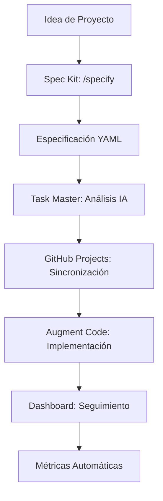

# 🚀 Metodología de Desarrollo con IA

Una metodología completa que integra **Spec Kit**, **Augment Code**, **MCP GitHub Project Manager** y **Claude Task Master** para desarrollo dirigido por especificaciones con trazabilidad visual completa.

## ✨ Características Principales

- 🎯 **Desarrollo dirigido por especificaciones** con Spec Kit
- 🤖 **IA integrada** para generación de código y gestión de tareas
- 📊 **Trazabilidad visual** completa desde specs hasta implementación
- 🔄 **Sincronización automática** con GitHub Projects V2
- 🛠️ **Configuración en 5 minutos** con un solo comando
- 📈 **Dashboard de progreso** en tiempo real

## 🚀 Quick Start

### 1. Configuración Inicial
```bash
# Ejecutar desde VS Code
# Paleta de comandos → Tasks: Run Task → AI: Setup Methodology

# O manualmente
bash ./.ai-methodology/ai-setup.sh
```

### 2. Configurar Variables
```bash
# Editar .env con tus credenciales
GITHUB_TOKEN=ghp_tu_token_aqui
GITHUB_OWNER=tu_usuario_o_organizacion  
GITHUB_REPO=nombre_del_repositorio
```

### 3. Instalar Sincronización
```bash
# Desde VS Code
# Tasks: Run Task → AI: Install Sync Module

# O manualmente
bash ./.ai-methodology/install-sync.sh
cd .ai-methodology/sync && npm run setup
```

### 4. Sincronizar y Desarrollar
```bash
# Sincronizar specs con GitHub Projects
# Tasks: Run Task → AI: Sync with GitHub

# Ver dashboard de progreso
# Tasks: Run Task → AI: Dashboard
```

## 🛠️ Herramientas Integradas

### 📋 Spec Kit (GitHub)
- Desarrollo dirigido por especificaciones
- Comandos `/specify`, `/plan`, `/tasks`
- Especificaciones ejecutables en YAML

### 🤖 Claude Task Master
- Gestión inteligente de tareas con IA
- Análisis de complejidad automático
- Generación de PRDs y breakdown de tareas

### 🔗 MCP GitHub Project Manager
- Sincronización bidireccional con GitHub Projects V2
- Trazabilidad completa de requerimientos
- Generación automática de issues y milestones

### 💬 Augment Code
- Asistente principal de desarrollo
- Acceso a todas las herramientas vía MCP
- Generación de código contextual

## 📊 Flujo de Trabajo



## 🎯 Comandos VS Code

| Comando | Descripción |
|---------|-------------|
| `AI: Setup Methodology` | Configuración inicial completa |
| `AI: Install Sync Module` | Instalar módulo de sincronización |
| `AI: Sync with GitHub` | Sincronizar specs → GitHub Projects |
| `AI: Dashboard` | Ver progreso y métricas |
| `AI: Setup MCP` | Configurar servidores MCP |

## 📁 Estructura del Proyecto

```
proyecto/
├── .ai-methodology/           # Metodología y configuración
│   ├── prompts/              # Templates de prompts para IA
│   ├── config/               # Configuraciones
│   ├── mappings/             # Mapeos spec → project
│   ├── context/              # Estado y contexto
│   └── sync/                 # Módulo de sincronización Node.js
├── specs/                    # Especificaciones YAML
├── docs/                     # Documentación y métricas
├── src/                      # Código fuente
└── tests/                    # Pruebas
```

## 🔧 Configuración Avanzada

### Variables de Entorno
```bash
# GitHub (Requerido)
GITHUB_TOKEN=ghp_tu_token
GITHUB_OWNER=usuario_o_org
GITHUB_REPO=nombre_repo
GITHUB_PROJECT_NUMBER=1

# IA (Al menos una requerida)
ANTHROPIC_API_KEY=sk-ant-...
OPENAI_API_KEY=sk-...
GOOGLE_API_KEY=...
PERPLEXITY_API_KEY=pplx-...

# Configuración de Metodología
ENHANCED_TASK_GENERATION=true
AUTO_CREATE_TRACEABILITY=true
VISUAL_TRACKING_ENABLED=true
```

### Configuración MCP
La metodología configura automáticamente servidores MCP para:
- **Cursor**: `.cursor/mcp.json`
- **VS Code**: `.vscode/mcp.json`
- **Windsurf**: `~/.codeium/windsurf/mcp_config.json`

## 📈 Dashboard y Métricas

### Dashboard en Terminal
```bash
cd .ai-methodology/sync
npm run dashboard
```

### Métricas Automáticas
- Archivo `docs/metrics.md` actualizado automáticamente
- Progreso de tareas por especificación
- Trazabilidad completa de requerimientos
- Análisis de actividad reciente

## 🤖 Comandos IA Disponibles

Una vez configurado MCP, usa en Augment Code Chat:

### Gestión de Proyectos
- `generate_prd` - Generar PRD desde idea
- `parse_prd` - Convertir PRD en tareas
- `add_feature` - Agregar nueva funcionalidad
- `create_traceability_matrix` - Trazabilidad completa

### Análisis de Tareas
- `analyze_task_complexity` - Análisis de complejidad
- `get_next_task` - Próxima tarea recomendada
- `expand_task` - Desglosar tareas complejas

### Sincronización
- `create_project` - Crear proyecto GitHub
- `sync_issues` - Sincronizar issues
- `update_project_status` - Actualizar estado

## 🔍 Ejemplo de Uso

### 1. Crear Especificación
```yaml
# specs/auth-system.spec.yaml
id: AUTH-001
title: Sistema de Autenticación
objectives:
  - Implementar login/logout seguro
  - Gestión de sesiones JWT
  - Recuperación de contraseña
acceptance_criteria:
  - Login con email/password
  - Tokens JWT con expiración
  - Endpoint de recuperación
tasks:
  - title: Crear endpoint POST /auth/login
    labels: [backend, auth, api]
    estimate: "3h"
  - title: Implementar middleware JWT
    labels: [backend, middleware]
    estimate: "2h"
  - title: Crear tests de autenticación
    labels: [testing, auth]
    estimate: "2h"
```

### 2. Sincronizar con GitHub
```bash
# Desde VS Code: Tasks → AI: Sync with GitHub
# O manualmente:
cd .ai-methodology/sync && npm run sync
```

### 3. Desarrollar con IA
En Augment Code Chat:
```
Basándome en la spec AUTH-001, implementa el endpoint POST /auth/login 
con validación de credenciales y generación de JWT.
```

### 4. Seguimiento
```bash
# Ver dashboard
cd .ai-methodology/sync && npm run dashboard

# O desde VS Code: Tasks → AI: Dashboard
```

## 🛠️ Troubleshooting

### Problemas Comunes

**Error: GitHub token inválido**
```bash
# Verificar token en .env
echo $GITHUB_TOKEN
# Regenerar token en GitHub Settings → Developer settings
```

**MCP servers no funcionan**
```bash
# Probar conexiones
cd .ai-methodology/sync && npm run mcp:test
# Reconfigurar
npm run mcp:install
```

**Sincronización falla**
```bash
# Verificar configuración
cd .ai-methodology/sync && npm run setup
# Ver logs detallados
npm run sync -- --verbose
```

## 📚 Documentación Adicional

- [Spec Kit Documentation](https://github.com/github/spec-kit)
- [Task Master AI](https://github.com/eyaltoledano/claude-task-master)
- [MCP GitHub Project Manager](https://github.com/kunwarVivek/mcp-github-project-manager)
- [Model Context Protocol](https://modelcontextprotocol.io/)

## 🤝 Contribuir

1. Fork el repositorio
2. Crea una rama: `git checkout -b feature/nueva-funcionalidad`
3. Commit: `git commit -m 'Agregar nueva funcionalidad'`
4. Push: `git push origin feature/nueva-funcionalidad`
5. Abre un Pull Request

## 📄 Licencia

MIT License - ver [LICENSE](LICENSE) para detalles.

---

**🎯 ¡Comienza ahora!** Ejecuta `Tasks: Run Task → AI: Setup Methodology` en VS Code y tendrás tu metodología funcionando en 5 minutos.
